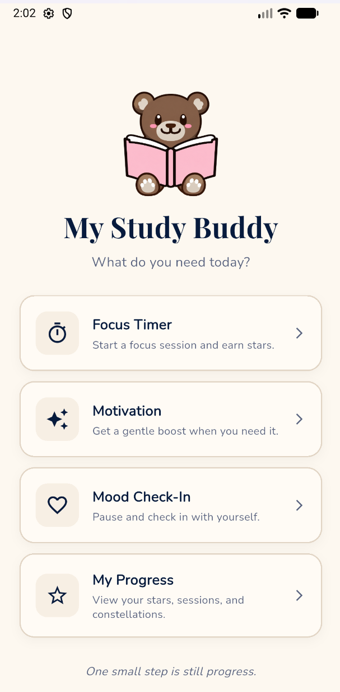
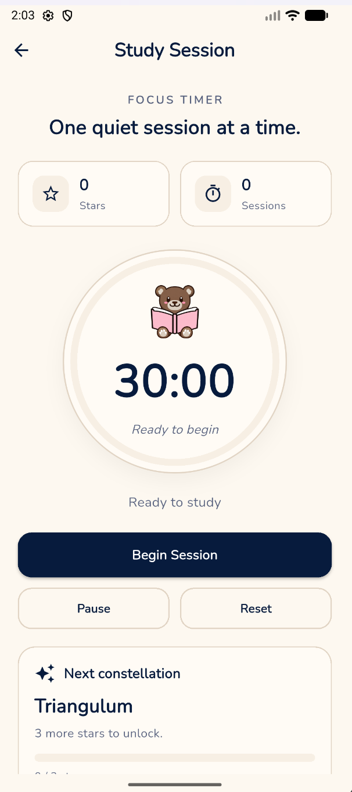
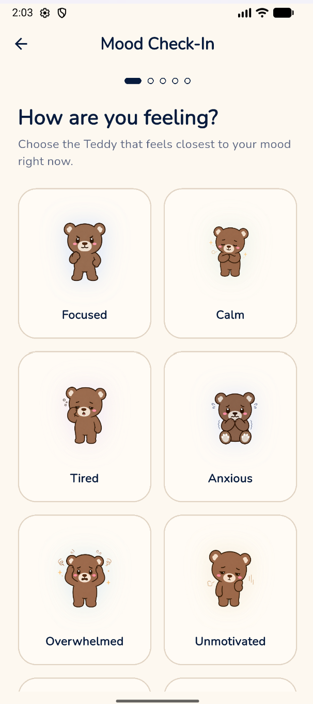
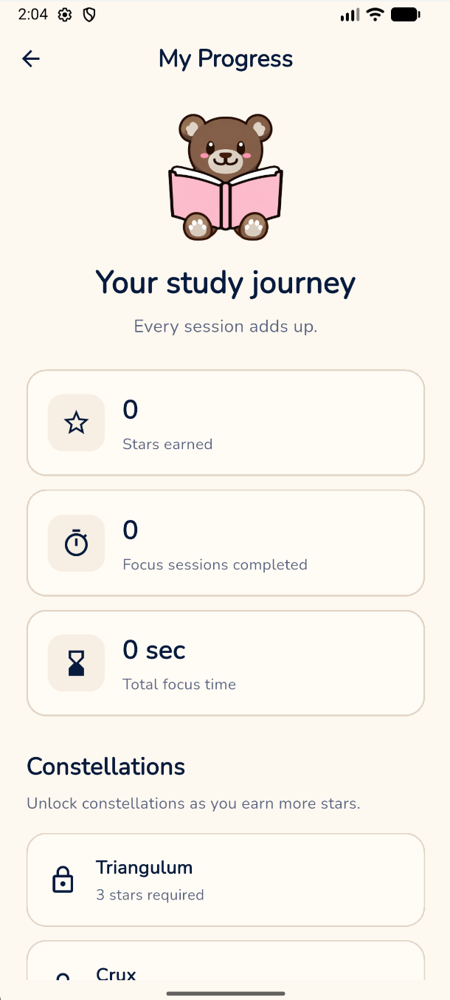

# My Study Buddy

My Study Buddy is a Flutter mobile app I built to help students study in a healthier and more balanced way.

I wanted to create an app that does more than track study time. Many students struggle with stress, low motivation, anxiety, or feeling overwhelmed while trying to work. My goal was to connect productivity with emotional balance by giving students tools to focus, reset their mood, stay motivated, and track their progress.

## Why I Built This

I built My Study Buddy because I wanted to explore how a study app could support both academic productivity and student well-being.

A lot of productivity apps focus only on tasks, timers, or streaks. I wanted this app to feel softer and more supportive. Instead of only asking students to “study more,” My Study Buddy encourages them to notice how they feel, take small steps, and build consistency without pressure or perfection.

## What Makes It Different

- I connected studying with mood awareness and emotional reset tools.
- I designed mood-based exercises instead of giving the same advice to every user.
- I used a calm teddy-themed interface to make the app feel less intimidating.
- I added stars and constellations to reward consistency in a gentle way.
- I focused on small realistic actions instead of pressure or perfection.

## Features

### Focus Timer

I created a focus timer that lets students start a study session and earn progress rewards when they complete it.

### Mood Check-In

I added a mood check-in where students can choose how they feel, such as anxious, tired, overwhelmed, calm, focused, or happy.

Based on the selected mood, the app suggests exercises like breathing, grounding, journaling, tiny steps, reframing, or intention setting.

### Motivation Boost

I created a motivation section where students can choose what they are struggling with and receive a short encouraging message with one small action they can take right away.

### Progress Tracking

I added a progress page that tracks completed sessions, earned stars, total focus time, and unlocked constellations using local storage.

## Screenshots

  
  
  
  

## Technologies Used

- Flutter
- Dart
- SharedPreferences
- Material Design

## What I Learned

While building this project, I practiced creating a multi-screen Flutter application, managing state, designing responsive UI components, using local storage, and organizing a complete mobile app around a real user need.

I also learned how to think beyond code by designing an app experience that supports both productivity and student well-being.

## Project Status

The main features are functional. I am currently improving the interface, cleaning the code, adding screenshots, and preparing the project for my portfolio.

## Disclaimer

My Study Buddy is not a medical or therapeutic tool. It is a student productivity and wellness project designed to support studying, motivation, and personal organization.

## Author

Created by Rym Zidi.